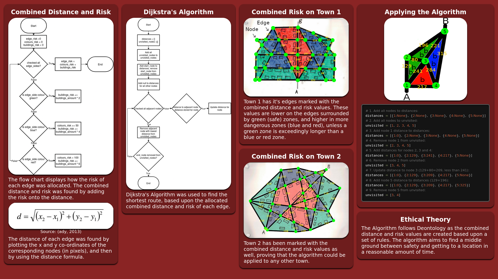

# Ethical Algorithm Poster

A poster for my core computing concepts coursework.

## General Information

This poster illustrates an algorithm that could be used for a self driving car to choose a route through a town or city.

It was created with HTML, CSS, and [Prism](https://prismjs.com) for the code formatting.

This repository also holds an [example](./ethical-algorithm/main.py) of how the code could look for the algorithm (not complete).

## Acknowledgements

- [Prism](https://prismjs.com/) for the code blocks.
